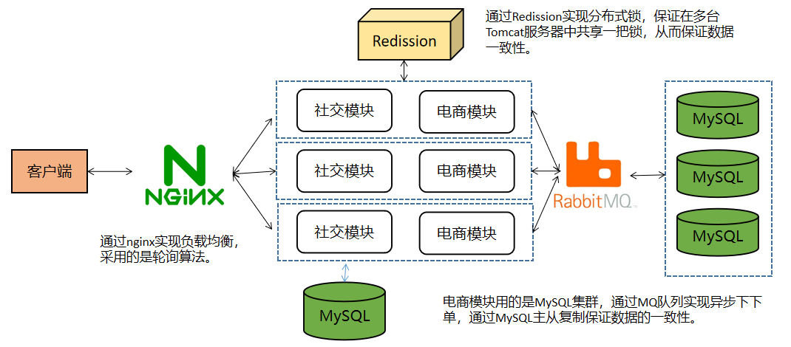

### 项目简介

口碑点评系统是一个分布式项目，类似于大众点评，实现了社交，电商等功能，该项目将社交与电商业务分离成两个服务，并部署在多个服务器上，使用**Nginx**作为反向代理实现负载均衡，实现集群+分布式架构，提高了系统的可用性和可扩展性，此外，采用消息队列实现异步下单提升用户体验，使用分布式锁实现商品秒杀功能，解决高并发场景下超买超卖问题。

下面是项目的架构图：

通过该项目，你可以

1 可以快速了企业项目开发的基本流程，增长开发经验；

2 了解需求分析过程，提高分析和设计能力；

3 对所学技术灵活应用，提高编码能力；

4 解决各种异常情况，提高代码调试能力。

### 项目页面展示

### 项目技术栈

前端：`HTML+CSS+JavaScript + Vue + ElementUI + JavaWeb`

后端：`SSMP + SpringBoot + MySQL + Lua`

中间件及开发环境：`Druid+Redission+Redis+RabbitMQ+Maven+Git`

开发环境：`Win10+CentOS7+IDEA2022+Tomcat7+JDK11`

### 如何启动

1 下载项目，安装项目所需组件，例如`MySQL,Redis,RabbitMQ`等；

2 按照`Pom.xml`导入相关依赖坐标，修改配置`application.yml`信息；

3 根据**Resource**目录下的数据模型，执行`**sql**`脚本，创建数据库及表信息；

4 修改配置**Nginx**中的**Conf**文件，包括服务器集群，端口，映射路径，默认页面等；

5 搭建好所有环境后，启动项目，访问http://localhost:8080，进入登录页面；

6 登录完成后进行首页，可以查看餐厅，评论，以及下单抢购商品；

### 优化空间

1 使用多级缓存，完成对商品信息，店铺信息的缓存，减少查询数据库的次数；

2 消息队列可以搭建集群，实现高可用；

3 秒杀接口地址隐藏，限流等。

### 秒杀逻辑执行过程

这里是秒杀逻辑的执行顺序。