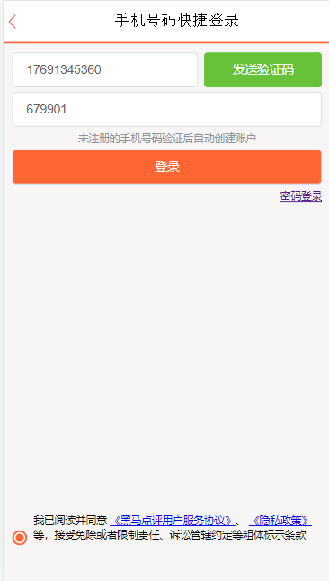

### 项目简介

口碑点评系统是一个分布式项目，类似于大众点评，实现了社交，电商等功能，该项目将社交功能模块与电商业务模块分离成两个服务，并部署在多个服务器上，使用**nginx**作为反向代理实现负载均衡，实现集群+分布式架构，提高了系统的可用性和可扩展性，此外，采用消息队列实现异步下单提升用户体验，使用分布式锁实现商品秒杀功能，解决高并发场景下超买超卖问题，同时使用MySQL主从复制实现读写分离，从而提升系统性能。

下面是项目的整体架构图：

通过该项目，你可以

1 可以快速了企业项目开发的基本流程，增长开发经验；

2 了解需求分析过程，提高分析和设计能力；

3 对所学技术灵活应用，提高编码能力；

4 解决各种异常情况，提高代码调试能力。

### 项目页面展示

<!--下面登录页面的展示：-->

<!--下面是系统首页的展示效果：-->

<!--下面是商家页面信息的展示：-->

### 项目技术栈

*前端*：`HTML+CSS+JavaScript + Vue + ElementUI + JavaWeb`

*后端*：`SpringBoot+MyBatisPlus+MySQL+Spring+SpringMVC`

*中间件及开发环境*：`Druid+Redission+Redis+Lua+RabbitMQ+Maven+Git`

*开发环境*：`Win10+CentOS7+IDEA2022+Tomcat7+JDK11`

### 如何启动

1 下载项目，安装项目所需组件，例如**MySQL,Redis,RabbitMQ**等；

2 搭建**MySQL**主从集群，在多台服务器上按照**MySQL**,修改**ServerID**,拷贝**BinLog**日志；

3 按照**Pom.xml**导入相关依赖坐标，修改配置**application.yml**信息；

4 根据**Resource**目录下的数据模型，执行**SQL**脚本，创建数据库及表信息；

5 修改配置**Nginx**中的**Conf**文件，包括服务器集群，端口，映射路径，默认页面等；

6 搭建好所有环境后，启动项目，访问**http://localhost:8080**，进入登录页面；

7 登录完成后进行首页，可以查看餐厅，评论，以及下单抢购商品；

### 秒杀过程执行逻辑

下面以秒杀为例，分析该过程的执行逻辑。

##### 第一阶段：用户登录相关逻辑

`1 用户在登录页面输入信息进行登录，点击登录后由nginx负载均衡算法选择相关服务器进行后续逻辑处理；`

`2 后端收到前端提交的表单数据进行校验，前端校验主要保证用户数据的公式正确，后端校验主要原因是避免因数据传输过程而导致的数据异常情况（虽然可能性极低）；`

`3 校验成功，则登录成功，服务端通过UUID生成token返回给客户端，之后的用户的请求会携带该token，并保存用户到session中。若校验失败，则转向失败的异常处理逻辑；封装请求结果返回给前端；`

##### 第二阶段：秒杀资格相关逻辑

`1 用户登录成功后，前端会展示渲染好的商品信息，这些热点数据一般会缓存在redis中，并设计逻辑过期时间，避免秒杀期间出现缓存击穿问题；`

`2 秒杀页面实时显示剩余时间，这也是判断秒杀资格的一项条件；这里需要使用拦截器限制访问次数，然后对用户的秒杀资格进行判断；`

`3 判断用户输入的验证码是否正确，判单库存是否充足，判断用户是否重复下单，若都满足则预减库存，并准备进行创建订单工作；若由条件不满足，则不能秒杀，转而执行对应的异常处理逻辑；这里在多台服务器上，使用Redission分布式锁保证避免超卖超买问题。`

##### 第三阶段：异步下单相关逻辑

`1 用户具有秒杀资格后，将请求用户，商品等信息写入MQ队列中，返回成功提示，后续由另外的线程从队列中取出订单完成创建，并进行数据库的写操作；`

`2 创建订单成功后，将该用户订单信息写入redis中，下次判断该用户是否重复下单时直接从redis中拿数据进行判断即可；`

`3 独立的线程从MQ队列取出订单信息，依次完成减库存，生成订单号等信息并保存。`

<!--下面是上述执行逻辑的流程图展示：-->

### 优化空间

1 使用多级缓存，完成对商品信息，店铺信息的缓存，减少查询数据库的次数；

2 消息队列和Redis可以搭建集群，实现高可用；

3 秒杀接口地址隐藏，限流等措施，提升系统的安全性。

##### @CopyRight 

###### 		Author:lin

###### 		Email:linlinwei@nuaa.edu.cn